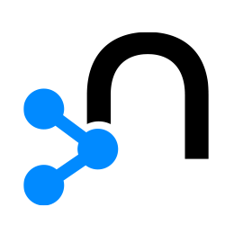

<h2 align="center"> George Lopez
	<h3 align="center">
		About Me
	</h3>
	

	First-class mathematics graduate from the University of Nottingham.
	

	

    		Experienced in programming languages and technologies related to software and data engineering.
	

</h2>

<h2 align="center"> Tech Stack </h2>

    <table>
    <tr align="center">
        <td></td>
        <td></td>
        <td></td>
        <td></td>
        <td></td>
        <td></td>
    </tr>
    <tr align="center">
        <td>Python</td>
        <td>PostgreSQL</td>
        <td>HTML</td>
        <td>Flask</td>
        <td>R</td>
        <td>Matlab</td>
    </tr>
    <tr align="center">
        <td></td>
        <td></td>
        <td></td>
        <td></td>
        <td></td>
        <td></td>
    </tr>
    <tr align="center">
        <td>Power BI</td>
        <td>Git</td>
        <td>Snowflake</td>
        <td>MongoDB</td>
        <td>Neo4j</td>
        <td>Tableau</td>
    </tr>
    </table>

<h2 align="center"> Connect with me </h2>

 

        
        
      

